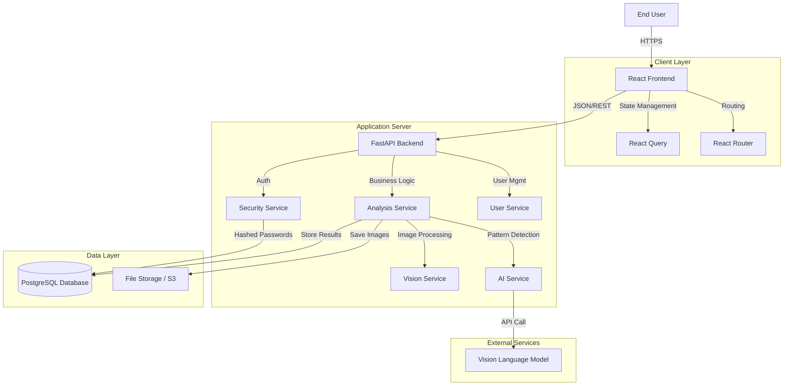
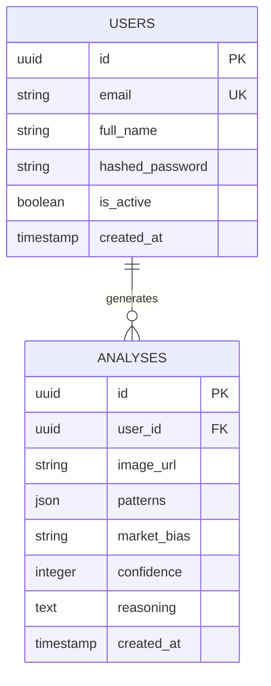

# Candle-Light: AI-Powered Technical Analysis Platform

## 1. Executive Summary

Candle-Light is an advanced financial technology application designed to bridge the gap between complex technical analysis and actionable trading insights. By leveraging cutting-edge Artificial Intelligence and Computer Vision, the platform automates the identification of candlestick patterns, reducing the barrier to entry for novice traders while providing objective validation for seasoned professionals.

## 2. Problem Statement

Technical analysis is the backbone of modern algorithmic and manual trading. However, it presents significant challenges:

*   **Subjectivity**: Two traders may interpret the same chart differently, leading to inconsistent decision-making.
*   **Complexity**: Mastery of hundreds of candlestick patterns (e.g., Doji, Hammer, Engulfing) requires years of experience.
*   **Time Constraints**: Manually scanning multiple charts across various timeframes is inefficient and prone to fatigue.
*   **Emotional Bias**: Traders often fall victim to confirmation bias, seeing patterns that support their desired trade direction rather than what the market is actually showing.

## 3. The Solution

Candle-Light solves these problems by providing an automated, objective, and instant analysis engine.

*   **Instant Recognition**: Users upload a chart image, and the system identifies patterns within seconds.
*   **Objective Analysis**: The AI evaluates charts based on visual data, devoid of emotional attachment to a position.
*   **Educational Value**: Detailed reasoning provided by the AI helps users learn why a pattern was identified.
*   **Quantifiable Confidence**: Every analysis comes with a confidence score and market bias (Bullish/Bearish/Neutral), allowing for risk-adjusted decision making.

## 4. System Architecture

The application is built on a Microservices-inspired Monolithic architecture to ensure robustness, scalability, and ease of maintenance.



### Component Details

1.  **Frontend (Client Layer)**
    *   **Technology**: React 18, TypeScript, Vite.
    *   **Role**: Handles user interaction, image upload, and visualization of analysis results. Uses `React Query` for efficient data fetching and caching.
    
2.  **Backend (Application Layer)**
    *   **Technology**: FastAPI (Python).
    *   **Role**: Serves as the central orchestrator. It validates requests, manages user sessions via JWT, and coordinates the analysis workflow.
    *   **Async Performance**: Utilizes Python's `asyncio` to handle concurrent API requests and AI processing tasks efficiently.

3.  **AI Service (Intelligence Layer)**
    *   **Technology**: OpenAI API / Google Gemini Integration.
    *   **Role**: Processes the visual data of the chart. It uses a specialized prompt engineering approach to extract structured JSON data (patterns, bias, confidence) from the image.

4.  **Database (Persistence Layer)**
    *   **Technology**: PostgreSQL (Production) / SQLite (Dev), SQLAlchemy ORM.
    *   **Role**: Stores user profiles, hashed credentials, and a complete history of all analyzed charts for historical review.

## 5. Database Schema

The data model is designed to support user ownership of analyses and efficient retrieval of history.



## 6. Current Implementation Status

We have successfully completed the foundational development phases.

*   **Authentication System**: Secure user registration and login flow using OAuth2-compliant JWT tokens.
*   **Analysis Pipeline**: End-to-end integration where an image uploaded from the React frontend is processed by the FastAPI backend, analyzed by the AI, and the results are stored and returned to the user.
*   **Dashboard**: A fully functional dashboard for managing uploads and viewing past analysis reports.
*   **Security**: Implementation of industry-standard password hashing (Bcrypt) and API route protection.

## 7. Future Scope & Roadmap

As we move towards a Version 2.0 release, the following features are planned:

### Short Term
*   **Google OAuth**: One-click sign-in integration.
*   **Export Functionality**: Ability to export analysis reports as PDF.

### Medium Term
*   **WebSocket Integration**: Real-time analysis status updates for a smoother user experience during high-load periods.
*   **Multi-Model Support**: User selection between various AI models (e.g., GPT-4o vs Claude 3.5 Sonnet) to compare analysis perspectives.

### Long Term
*   **Automated Trading Bot**: Capabilities to execute trades via exchange APIs (Binance/Coinbase) based on high-confidence AI signals.
*   **Mobile Application**: A React Native mobile app for on-the-go analysis.

---

## 8. Installation and Setup guide

### Backend Setup

1.  Navigate to the backend directory:
    ```bash
    cd backend
    ```
2.  Create a virtual environment:
    ```bash
    python -m venv venv
    ```
3.  Activate the environment:
    *   Windows: `.\venv\Scripts\activate`
    *   Mac/Linux: `source venv/bin/activate`
4.  Install dependencies:
    ```bash
    pip install -r requirements.txt
    ```
5.  Run the server:
    ```bash
    python -m uvicorn app.main:app --reload
    ```
    The API will be available at `http://localhost:8000`.

### Frontend Setup

1.  Navigate to the frontend directory:
    ```bash
    cd frontend
    ```
2.  Install dependencies:
    ```bash
    npm install
    ```
3.  Run the development server:
    ```bash
    npm run dev
    ```
    The application will be accessible at `http://localhost:8080`.
