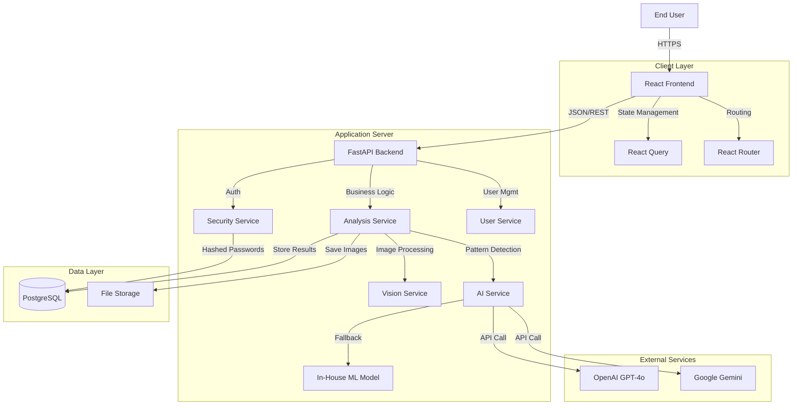
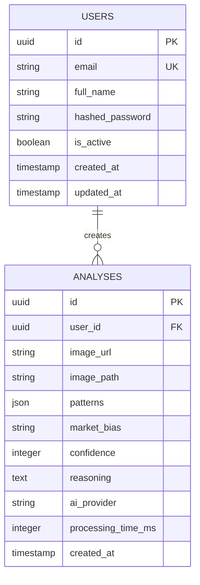

# Candle-Light

## AI-Powered Technical Analysis Platform

Candle-Light is an advanced financial technology application that bridges the gap between complex technical analysis and actionable trading insights. By leveraging Artificial Intelligence and Computer Vision, the platform automates the identification of candlestick patterns, reducing the barrier to entry for novice traders while providing objective validation for seasoned professionals.

---

## Table of Contents

1. [Problem Statement](#1-problem-statement)
2. [The Solution](#2-the-solution)
3. [Features](#3-features)
4. [Technology Stack](#4-technology-stack)
5. [System Architecture](#5-system-architecture)
6. [Database Schema](#6-database-schema)
7. [In-House Pattern Detection Engine](#7-in-house-pattern-detection-engine)
8. [API Reference](#8-api-reference)
9. [Installation](#9-installation)
10. [Deployment](#10-deployment)
11. [Project Structure](#11-project-structure)
12. [Current Status](#12-current-status)
13. [Roadmap](#13-roadmap)
14. [Contributing](#14-contributing)
15. [License](#15-license)

---

## 1. Problem Statement

Technical analysis is fundamental to modern trading, yet it presents significant challenges:

| Challenge | Description |
|-----------|-------------|
| **Subjectivity** | Two traders may interpret the same chart differently, leading to inconsistent decisions |
| **Complexity** | Mastery of hundreds of candlestick patterns requires years of experience |
| **Time Constraints** | Manually scanning multiple charts across timeframes is inefficient and error-prone |
| **Emotional Bias** | Traders often see patterns that support their desired direction rather than reality |

---

## 2. The Solution

Candle-Light addresses these challenges through:

- **Instant Recognition**: Upload a chart image and receive pattern identification within seconds
- **Objective Analysis**: AI evaluates charts based on visual data without emotional bias
- **Educational Value**: Detailed reasoning helps users understand pattern identification
- **Quantifiable Confidence**: Every analysis includes confidence scores and market bias indicators

---

## 3. Features

### Core Capabilities
- Image-based candlestick pattern detection
- Support for 25+ chart patterns (single, double, triple, and complex)
- Market bias determination (Bullish/Bearish/Neutral)
- Confidence scoring with statistical backing
- Analysis history with full audit trail

### Analysis Engine
- Multi-provider AI support (OpenAI GPT-4o, Google Gemini)
- In-house pattern detection fallback (works offline)
- Rule-based pattern recognition with 70-85% reliability ratings
- Volume and context-aware analysis

### User Management
- Secure JWT-based authentication
- Password hashing with Bcrypt
- Session management and token refresh
- User profile and statistics tracking

---

## 4. Technology Stack

### Frontend
| Component | Technology |
|-----------|------------|
| Framework | React 18 |
| Language | TypeScript |
| Build Tool | Vite |
| Styling | Tailwind CSS |
| UI Components | shadcn/ui |
| State Management | React Query |
| Routing | React Router v6 |

### Backend
| Component | Technology |
|-----------|------------|
| Framework | FastAPI |
| Language | Python 3.11+ |
| Database | PostgreSQL / SQLite |
| ORM | SQLAlchemy 2.0 (async) |
| Authentication | JWT (python-jose) |
| Image Processing | OpenCV, Pillow |
| AI Providers | OpenAI, Google Generative AI |

### DevOps
| Component | Technology |
|-----------|------------|
| Containerization | Docker |
| Orchestration | Docker Compose |
| CI/CD | GitHub Actions |
| Cloud Platforms | Render, Railway |

---

## 5. System Architecture

The application follows a Microservices-inspired Monolithic architecture for robustness and maintainability.



---

## 6. Database Schema



---

## 7. In-House Pattern Detection Engine

The platform includes a comprehensive rule-based pattern detection system that works without external AI dependencies.

### Supported Patterns

**Single Candle Patterns**
- Doji (Standard, Dragonfly, Gravestone)
- Hammer / Inverted Hammer
- Shooting Star
- Marubozu

**Double Candle Patterns**
- Bullish/Bearish Engulfing
- Piercing Line / Dark Cloud Cover
- Tweezer Top / Bottom
- Harami patterns

**Triple Candle Patterns**
- Morning Star / Evening Star
- Three White Soldiers / Three Black Crows
- Three Inside Up / Down

**Complex Chart Patterns**
- Double Top / Double Bottom
- Head and Shoulders (Regular and Inverse)
- Ascending / Descending Triangle
- Rising / Falling Wedge

### Pattern Metrics
Each pattern includes:
- Historical win rate (52-83%)
- Average gain/loss ratios
- Risk/reward calculations
- Optimal market contexts
- Volume requirements
- Trading setup recommendations

---

## 8. API Reference

### Authentication Endpoints

| Method | Endpoint | Description |
|--------|----------|-------------|
| POST | `/auth/register` | Create new user account |
| POST | `/auth/login` | Authenticate and receive JWT |
| POST | `/auth/refresh` | Refresh access token |
| GET | `/auth/me` | Get current user info |
| POST | `/auth/logout` | Invalidate session |

### Analysis Endpoints

| Method | Endpoint | Description |
|--------|----------|-------------|
| POST | `/analysis/upload` | Upload chart for analysis |
| GET | `/analysis/history` | Get user's analysis history |
| GET | `/analysis/{id}` | Get specific analysis |
| DELETE | `/analysis/{id}` | Delete analysis record |

### User Endpoints

| Method | Endpoint | Description |
|--------|----------|-------------|
| GET | `/users/profile` | Get user profile |
| PUT | `/users/profile` | Update user profile |
| GET | `/users/stats` | Get user statistics |

### Health Endpoints

| Method | Endpoint | Description |
|--------|----------|-------------|
| GET | `/health` | API health check |
| GET | `/health/ai` | AI provider status |

---

## 9. Installation

### Prerequisites
- Python 3.11 or higher
- Node.js 18 or higher
- PostgreSQL (production) or SQLite (development)

### Backend Setup

```bash
# Navigate to backend directory
cd backend

# Create virtual environment
python -m venv venv

# Activate environment
# Windows:
.\venv\Scripts\activate
# macOS/Linux:
source venv/bin/activate

# Install dependencies
pip install -r requirements.txt

# Configure environment
cp .env.example .env
# Edit .env with your settings

# Run development server
python -m uvicorn app.main:app --reload --port 8000
```

### Frontend Setup

```bash
# Navigate to frontend directory
cd frontend

# Install dependencies
npm install

# Run development server
npm run dev
```

### Access Points
- Frontend: http://localhost:8080
- Backend API: http://localhost:8000
- API Documentation: http://localhost:8000/docs

---

## 10. Deployment

### Docker Compose (Recommended for Local)

```bash
# Start all services
docker-compose up -d

# View logs
docker-compose logs -f

# Stop services
docker-compose down
```

### Render.com

1. Fork or push this repository to GitHub
2. Connect your repository to Render
3. Render will auto-detect `render.yaml` and configure services
4. Set environment variables in the Render dashboard
5. Deploy

### Railway

```bash
# Install Railway CLI
npm install -g @railway/cli

# Login
railway login

# Deploy
railway up
```

### Environment Variables

| Variable | Description | Default |
|----------|-------------|---------|
| `DATABASE_URL` | PostgreSQL connection string | SQLite (dev) |
| `JWT_SECRET_KEY` | Secret for JWT signing | Required |
| `AI_PROVIDER` | AI service (openai/gemini/inhouse/demo) | demo |
| `OPENAI_API_KEY` | OpenAI API key | Optional |
| `GOOGLE_AI_API_KEY` | Google AI API key | Optional |
| `CORS_ORIGINS` | Allowed origins | localhost |

---

## 11. Project Structure

```
Candle-Light/
├── backend/
│   ├── app/
│   │   ├── core/          # Security, dependencies, exceptions
│   │   ├── ml/            # In-house pattern detection
│   │   │   ├── patterns.py      # 25+ pattern definitions
│   │   │   ├── image_processor.py
│   │   │   └── pattern_detector.py
│   │   ├── models/        # SQLAlchemy models
│   │   ├── routers/       # API route handlers
│   │   ├── schemas/       # Pydantic schemas
│   │   ├── services/      # Business logic
│   │   ├── config.py      # Configuration
│   │   ├── database.py    # Database setup
│   │   └── main.py        # FastAPI application
│   ├── uploads/           # Chart image storage
│   ├── Dockerfile
│   └── requirements.txt
├── frontend/
│   ├── src/
│   │   ├── components/    # React components
│   │   ├── contexts/      # Auth context
│   │   ├── pages/         # Page components
│   │   ├── services/      # API client
│   │   └── App.tsx
│   ├── Dockerfile
│   └── package.json
├── docker-compose.yml
├── render.yaml
├── railway.toml
└── README.md
```

---

## 12. Current Status

### Completed
- User authentication system (JWT)
- Chart upload and analysis pipeline
- Multi-provider AI integration
- In-house ML pattern detection (25+ patterns)
- Analysis history and management
- Frontend-backend integration
- Docker and cloud deployment configs

### In Progress
- Google OAuth integration
- Enhanced mobile responsiveness

---

## 13. Roadmap

### Phase 1 (Current)
- Core platform functionality
- Pattern detection with confidence scoring
- User management and history

### Phase 2 (Q2 2026)
- Google OAuth integration
- PDF export functionality
- Enhanced pattern explanations

### Phase 3 (Q3 2026)
- WebSocket real-time updates
- Multi-model comparison
- Advanced backtesting

### Phase 4 (Q4 2026)
- Mobile application (React Native)
- Exchange API integration
- Automated trading signals

---

## 14. Contributing

Contributions are welcome. Please follow these steps:

1. Fork the repository
2. Create a feature branch (`git checkout -b feature/amazing-feature`)
3. Commit your changes (`git commit -m 'Add amazing feature'`)
4. Push to the branch (`git push origin feature/amazing-feature`)
5. Open a Pull Request

### Development Guidelines
- Follow existing code style and conventions
- Write tests for new functionality
- Update documentation as needed
- Ensure all tests pass before submitting

---

## 15. License

This project is licensed under the MIT License. See the [LICENSE](LICENSE) file for details.

---

**Candle-Light** - Bringing objectivity to technical analysis through artificial intelligence.
